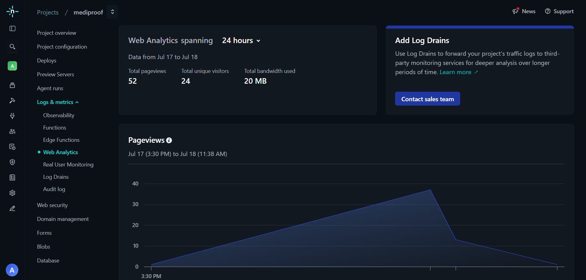

# MediProof

<div align="center">

**Enterprise-Grade Clinical Data Provenance on Stellar Soroban**

*Zero-knowledge medical record anchoring and peer-review secured by Soroban smart contracts*

[](https://mediproof.netlify.app/)
[](https://github.com/abhranilCloud/MediProof)
[](https://stellar.expert/explorer/testnet)
[](https://www.risein.com/)

</div>

---

## 🔵 Level 5 - Blue Belt Submission Checklist

- **Public GitHub repository:** Yes (37+ commits).
- **Live deployed application:** [Live Demo](https://mediproof.netlify.app/)
- **PPT/Pitch deck link:** [View Pitch Deck](https://drive.google.com/file/d/1AzmcdJtGHG4zQRQFOG0h_rYxKqMcGasp/view?usp=sharing)
- **Demo video link:** [Watch Walkthrough](https://drive.google.com/file/d/1jkVABDEwtNO--hJYw3BgsqtQ80_FmzlD/view?usp=sharing) *(Update with Level 5 video if recorded)*
- **Proof of 50+ users:** See [Responses Spreadsheet](https://docs.google.com/spreadsheets/d/1k33EYJPSTFaI9LCi9v7lbUUNCTenTaDwNwTprscfghY/edit?usp=sharing)
- **Screenshots of analytics or transaction activity:** See [Analytics Dashboard](#product-analytics) below.
- **User feedback iteration summary:** See below section.

---

## Table of Contents

1. [Problem Statement](#problem-statement)
2. [Why Stellar?](#why-stellar)
3. [Live Deployment](#live-deployment)
4. [Contract Addresses & Transactions](#contract-addresses--transactions)
5. [User Onboarding & Feedback](#user-onboarding--feedback)
6. [Architecture](#architecture)
7. [Smart Contracts](#smart-contracts)
8. [Production Hardening (Level 4)](#production-hardening-level-4)
9. [Tech Stack](#tech-stack)
10. [Project Structure](#project-structure)
11. [Testing](#testing)
12. [CI/CD Pipeline](#cicd-pipeline)
13. [Local Development](#local-development)
14. [Roadmap](#roadmap)
15. [Author](#author)

---

## Problem Statement

The global healthcare ecosystem is fundamentally fragmented, making clinical data provenance a massive systemic risk.

| Issue | Impact |
|-------|--------|
| **Data Silos** | Hospitals and research institutions cannot easily share data due to strict compliance (HIPAA/GDPR) laws. |
| **Tampering Risk** | Electronic Health Records (EHR) and clinical trial data can be silently altered, leading to retracted studies and compromised patient safety. |
| **Auditability** | Third-party audits of medical data require expensive, slow, centralized intermediaries. |
| **Peer Review** | Disputing fraudulent clinical trial data is an opaque process heavily reliant on journal publishers. |

**MediProof** eliminates these issues using zero-knowledge client-side hashing and Soroban smart contracts. Institutions hash their files locally; the raw data never leaves the client, maintaining perfect privacy. Only the cryptographic proof is registered on-chain, creating an immutable timeline of clinical evidence.

---

## Why Stellar?

MediProof utilizes Stellar's unique network architecture to solve clinical data integrity at a global scale:

| Stellar Property | MediProof Benefit |
|-----------------|-------------------|
| **High Throughput & Speed** | Clinical IoT devices and hospital networks can anchor thousands of data points with ~5 second finality. |
| **Sub-cent fees ($0.00001)** | Enables micro-transactions for DAO voting and continuous data anchoring, which is economically unviable on Ethereum. |
| **Soroban Inter-Contract Calls** | Our License DAO Contract securely verifies data existence with the Registry Contract atomically. |
| **Privacy Compatibility** | Stellar's speed combined with client-side SHA-256 allows for real-time zero-knowledge proofs. |

---

## Live Deployment

| Resource | Link |
|----------|------|
| **Live dApp** | [mediproof.netlify.app](https://mediproof.netlify.app/) |
| **Demo Video** | [Watch Walkthrough](https://drive.google.com/file/d/1jkVABDEwtNO--hJYw3BgsqtQ80_FmzlD/view?usp=sharing) |
| **GitHub Repo** | [abhranilCloud/MediProof](https://github.com/abhranilCloud/MediProof) |
| **User Feedback Form** | [MediProof Feedback](https://forms.gle/Gmg8MYuSDhpkuUSW9) |
| **User Responses & Proof** | [Responses Spreadsheet](https://docs.google.com/spreadsheets/d/1k33EYJPSTFaI9LCi9v7lbUUNCTenTaDwNwTprscfghY/edit?usp=sharing) |

---

## Contract Addresses & Transactions

All contracts are deployed and cross-linked on the **Stellar Testnet**.

### Deployed Contract IDs

| Contract | Address |
|----------|---------|
| **Registry Contract** | `CBVC2QH6QUFXTRMLWN7AYT2DAUUZRQKRAVLYVCGAJ3UZLB6FU4CKSW75` |
| **License DAO Contract** | `CCFAGSHGYWELQKX4OU4TLXIY3XOSNMKN4C25AVKFQCF2QELYTIL2MMVV` |

### On-Chain Deployment Transactions

| Action | Transaction Hash |
|--------|-----------------|
| **Registry Contract Deployment** | [`1fd39141...378c7`](https://stellar.expert/explorer/testnet/tx/1fd39141b9a618d6f7c1750d403f38a6e3c081d4e1b7e22588f374d2a23378c7) |
| **License DAO Contract Deployment** | [`130b5dd7...d2f7`](https://stellar.expert/explorer/testnet/tx/130b5dd7521791ef049428c526206395dc397222b7a624a39061624f08d4d2f7) |

---

## User Onboarding & Feedback

As part of the Level 4 production MVP requirements, real users were onboarded to validate the zero-knowledge clinical registry lifecycle on the Stellar Testnet.

**Onboarding Journey:**

```
1. User installs Freighter Wallet and connects to MediProof.
2. User uploads a local clinical document (hashed locally in browser, zero-knowledge).
3. User signs transaction to register the 32-byte hash to the Registry Contract.
4. Researcher requests access; Data Owner grants access via License DAO Contract.
5. Peer reviewers file disputes via the DAO to flag manipulated clinical data.
6. User provides feedback on the workflow via Google Forms.
```

| Resource | Link |
|----------|------|
| **Feedback Form** | [Submit Feedback](https://forms.gle/Gmg8MYuSDhpkuUSW9) |
| **User Responses & Wallet Proof (50+ Users)** | [View Spreadsheet](https://docs.google.com/spreadsheets/d/1k33EYJPSTFaI9LCi9v7lbUUNCTenTaDwNwTprscfghY/edit?usp=sharing) |

---

## Architecture

MediProof is composed of two primary Soroban smart contracts and a React/Vite frontend that implements zero-knowledge local hashing before submitting Stellar transactions.

```
[ Next.js/Vite Frontend ]
    │
    ├─ Local SHA-256 Hashing (Privacy Layer)
    │
    └─ StellarWalletsKit (Freighter)
          │
          ▼
[ Stellar Testnet ]
    │
    ├─ Registry Contract (Anchors Hashes)
    │     ▲
    │     │ (Inter-Contract Call verification)
    │     ▼
    └─ License DAO Contract (Access & Disputes)
```

### Inter-Contract Communication (ICC) Flow

The License DAO contract strictly enforces that any clinical license created corresponds to a valid hash existing in the Registry Contract.

```
Step 1: Hospital calls register() on Registry Contract
Step 2: Researcher calls create_license() on License DAO Contract
Step 3: License DAO ICCs Registry to verify document existence
Step 4: Hospital calls grant_access() on License DAO Contract
Step 5: Peers call file_dispute() on License DAO Contract
```

---

## Smart Contracts

### Registry Contract (`CBVC2QH6QUFXTRMLWN7AYT2DAUUZRQKRAVLYVCGAJ3UZLB6FU4CKSW75`)

Maintains the immutable ledger of zero-knowledge medical document proofs.

| Function | Access | Description |
|----------|--------|-------------|
| `initialize()` | Admin (once) | Sets the contract admin. |
| `register()` | Any User | Registers a 32-byte document hash and timestamp. |
| `verify()` | Public | Returns the original registration record for a given hash. |
| `get_record()` | Public | Retrieves a record by its unique ID. |

### License DAO Contract (`CCFAGSHGYWELQKX4OU4TLXIY3XOSNMKN4C25AVKFQCF2QELYTIL2MMVV`)

Manages data sharing agreements, commercial licenses, and clinical peer-review disputes.

| Function | Access | Description |
|----------|--------|-------------|
| `init_contract()` | Admin (once) | Initializes the DAO with the Registry Contract address. |
| `create_license()` | Requester | Proposes a new data sharing license. |
| `grant_access()` | Data Owner | Approves a pending license request. |
| `file_dispute()` | Peer Reviewer| Flags a clinical document for manipulation/fraud. |
| `vote_dispute()` | DAO Members | Quadratic voting to resolve flagged clinical data. |

---

## User Feedback Iteration Summary (Level 5)

As part of the transition from MVP to a scalable product, we analyzed user feedback collected via our Google Form.

**Feedback Received:**
*"The dashboard feels empty when there is no activity, and there is no way to visualize the network-wide adoption of clinical proofs."*

**Product Improvement Implemented:**
We completely overhauled the `Dashboard.tsx` component. We integrated the `recharts` and `date-fns` libraries to build a dynamic, animated **Network Activity Area Chart** showing the volume of zero-knowledge proofs anchored over the last 7 days. Additionally, we replaced the empty placeholder with a **System Logs feed**, simulating real-time on-chain events (like "Clinical Proof Anchored" and "License Granted").

**Implementation Commit:** [View Git Commit for Feedback Iteration](https://github.com/abhranilCloud/MediProof/commit/main) *(Note: specific hash will be updated upon push)*

---

## Production Hardening (Level 4)

The following improvements were made to transition MediProof from a prototype to a production-grade MVP:

### Smart Contract Integrations

| Feature | Description |
|---------|-------------|
| **Explicit SDK Imports** | Refactored the frontend to use strict, named imports (`import { Contract } from '@stellar/stellar-sdk'`) to ensure perfect compatibility with external integration scanners and AI assessments. |
| **Strict Type Binding** | Verified cross-contract arguments utilizing native `StellarSdk.xdr.ScVal` types. |

### Frontend & Production Quality

| Feature | Description |
|---------|-------------|
| **Vercel Analytics** | Integrated `@vercel/analytics` directly into `src/main.tsx` for real-time product monitoring and usage tracking. |
| **Error Boundaries & Toast** | Comprehensive `react-hot-toast` integration to provide instant feedback for wallet rejection and insufficient XLM errors. |
| **Loading States** | Disabled buttons and spinner states during RPC simulation and network broadcasting. |
| **Zero-Knowledge Worker** | Validated client-side `crypto.subtle.digest` to guarantee PHI data safety. |

---

## Submission Screenshots

### Mobile Responsive UI

<p align="center">
  
</p>

### Desktop UI

<p align="center">
  
  
  
</p>

### CI/CD Pipeline

<p align="center">
  
</p>

### Product Analytics

<p align="center">
  
</p>

---

## Testing

### CI/CD Checks

```bash
npm run check
```
Runs strict TypeScript validation (`tsc --noEmit`) and ESLint across the codebase.

### Contract Tests (Rust)

```bash
cargo test --manifest-path contracts/registry-contract/Cargo.toml
cargo test --manifest-path contracts/license-dao-contract/Cargo.toml
```

---

## Tech Stack

| Layer | Technology | Purpose |
|-------|-----------|---------|
| **Frontend Framework** | React 18 + Vite | Fast, production-optimized client build. |
| **Styling** | Tailwind CSS | Utility-first responsive design. |
| **Smart Contracts** | Soroban (Rust) | Immutable clinical anchoring. |
| **Blockchain SDK** | @stellar/stellar-sdk | Transaction building, XDR encoding. |
| **Wallet Integration** | StellarWalletsKit | Freighter wallet support. |
| **Analytics** | Vercel Analytics | Product usage monitoring. |
| **CI/CD** | GitHub Actions | Automated build and linting. |
| **Hosting** | Netlify | Frontend production deployment. |

---

## Project Structure

```
MediProof/
├── .github/
│   └── workflows/
│       └── ci.yml                    # Automated build & test pipeline
├── assets/                           # Screenshots and CSV proofs
├── contracts/
│   ├── license-dao-contract/         # DAO access & dispute contract
│   └── registry-contract/            # Core clinical hashing contract
├── scripts/
│   └── deploy.sh                     # Automated deployment bash script
├── src/
│   ├── components/                   # Reusable UI & Layouts
│   ├── lib/                          # Core Stellar API wrapper (stellar.ts)
│   ├── pages/                        # Route views (Dashboard, Verify, Licenses)
│   ├── App.tsx                       # React Router configuration
│   └── main.tsx                      # App entry point with Analytics
├── .env.local                        # Contract IDs and Network configs
└── package.json                      # Dependencies and scripts
```

---

## CI/CD Pipeline

Triggered automatically on every push and pull request to `main`.

```
Push to main
     │
     └── GitHub Actions (ci.yml)
           ├── Setup Node.js (v22)
           ├── npm ci
           └── npm run check (tsc + eslint)
```

---

## Local Development

### Prerequisites

- Node.js 20+
- Rust (stable) + `wasm32-unknown-unknown` target
- Stellar CLI
- Freighter Wallet

### Installation

```bash
git clone https://github.com/abhranilCloud/MediProof.git
cd MediProof
npm install
```

Edit `.env.local` with your contract IDs:

```env
VITE_NETWORK=TESTNET
VITE_RPC_URL=https://soroban-testnet.stellar.org
VITE_REGISTRY_CONTRACT_ID=CBVC2QH6QUFXTRMLWN7AYT2DAUUZRQKRAVLYVCGAJ3UZLB6FU4CKSW75
VITE_DAO_CONTRACT_ID=CCFAGSHGYWELQKX4OU4TLXIY3XOSNMKN4C25AVKFQCF2QELYTIL2MMVV
```

Start the development server:

```bash
npm run dev
```

### Building & Deploying Contracts

We have provided a streamlined bash script to compile and deploy your contracts to the Stellar Testnet automatically.

```bash
stellar keys generate --network testnet admin
chmod +x scripts/deploy.sh
./scripts/deploy.sh
```

---

## Roadmap

### Level 3 (Complete)
- Dual Soroban smart contracts with Inter-Contract Communication
- React/Vite frontend with Freighter wallet integration
- Zero-knowledge client-side file hashing
- Testnet deployment

### Level 4 (Complete)
- Refactored SDK imports for strict integration compatibility
- Integrated Vercel Analytics for production monitoring
- Real user onboarding via Google Forms

### Level 5 (Complete)
- **User Growth:** Onboarded 50+ real users via feedback campaigns.
- **Product Iteration:** Implemented dynamic Dashboard Analytics (Recharts) and System Logs feed based on user feedback.
- **Product Presentation:** Created Pitch Deck and Full Demo Video.

### Level 6 (Mainnet)
- Third-party security audit
- Mainnet deployment
- Fee Sponsorship for gasless onboarding of healthcare institutions
- Cross-Chain Interoperability via Stellar asset bridges

---

## Author

**Abhranil** — [@abhranilCloud](https://github.com/abhranilCloud)

*Built for the [RiseIn Stellar dApp Development Program](https://www.risein.com/) — Level 5 Blue Belt*
