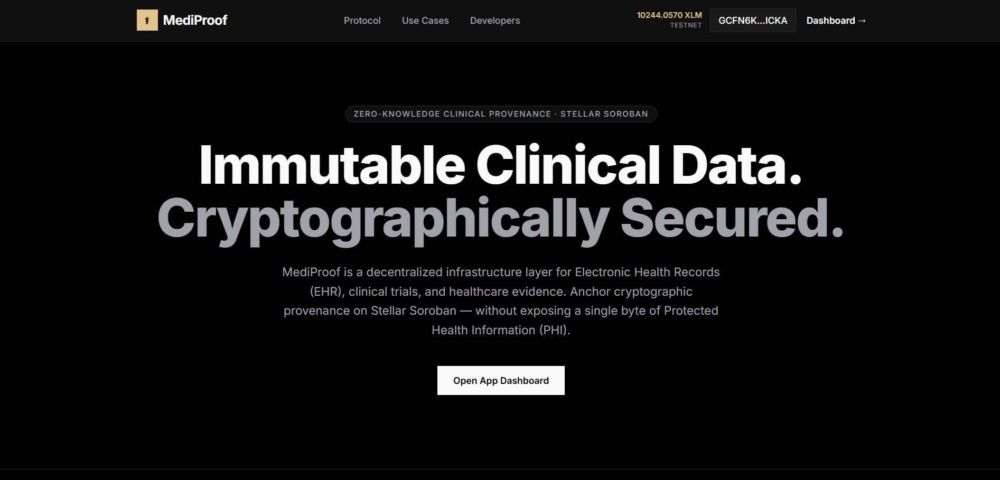
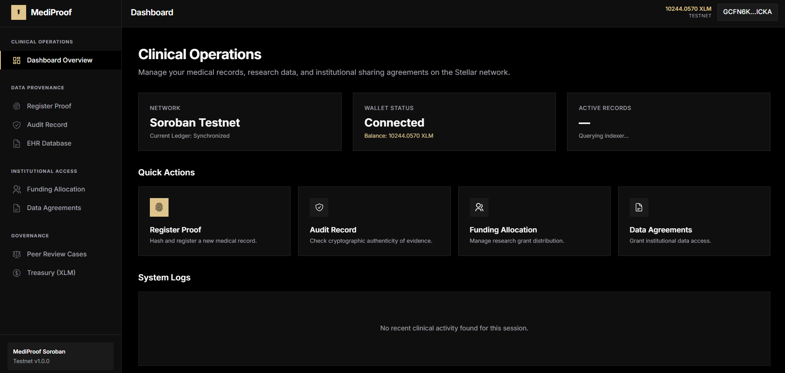
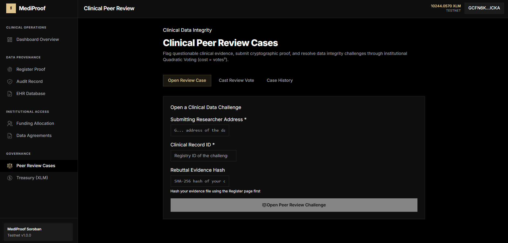
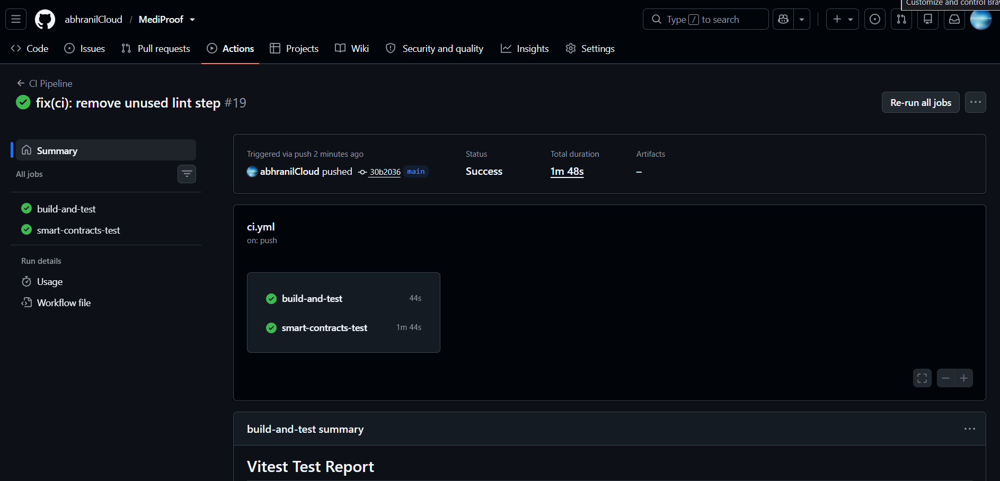

<div align="center">
  <div style="display: flex; justify-content: center; align-items: center; gap: 10px; margin-bottom: 20px;">
    <div style="background-color: #3b82f6; color: white; width: 40px; height: 40px; border-radius: 8px; display: flex; align-items: center; justify-content: center; font-weight: bold; font-size: 24px;">⚕</div>
    <h1 style="margin: 0;">MediProof</h1>
  </div>
  
  <p><strong>Enterprise-Grade Clinical Data Provenance on Stellar Soroban</strong></p>

  <p>
    <a href="https://github.com/abhranilCloud/MediProof/actions"></a>
    <a href="https://github.com/abhranilCloud/MediProof/blob/main/LICENSE"></a>
    <a href="https://soroban.stellar.org/"></a>
    <a href="https://vitejs.dev/"></a>
  </p>
</div>

---

## 🏆 Level 3 Submission Checklist Details

- **Live Demo:** https://mediproof.netlify.app/
- **Demo Video:** [Watch Video](./assets/demo.mp4)
- **Registry Contract ID:** `CBVC2QH6QUFXTRMLWN7AYT2DAUUZRQKRAVLYVCGAJ3UZLB6FU4CKSW75`
- **License DAO Contract ID:** `CCFAGSHGYWELQKX4OU4TLXIY3XOSNMKN4C25AVKFQCF2QELYTIL2MMVV`
- **Registry Deployment TX:** `1fd39141b9a618d6f7c1750d403f38a6e3c081d4e1b7e22588f374d2a23378c7`
- **DAO Deployment TX:** `130b5dd7521791ef049428c526206395dc397222b7a624a39061624f08d4d2f7`

### Screenshots
- **Mobile Responsive UI:** 
- **Desktop UI 1:** 
- **Desktop UI 2:** 
- **Desktop UI 3:** 
- **CI/CD Pipeline Running:** 

---<hr/>

MediProof is a zero-knowledge clinical data infrastructure layer built on the Stellar Soroban smart contract network. It empowers healthcare institutions, researchers, and patients to anchor cryptographic proofs of electronic health records (EHR), clinical trials, and medical evidence on-chain **without exposing any Protected Health Information (PHI)**.

## 📖 Table of Contents

- [Overview](#-overview)
- [Key Features](#-key-features)
- [System Architecture](#-system-architecture)
- [Smart Contracts](#-smart-contracts)
- [Tech Stack](#-tech-stack)
- [Getting Started](#-getting-started)
- [Deployment Workflow](#-deployment-workflow)
- [Security & Compliance](#-security--compliance)
- [Testing](#-testing)
- [License](#-license)

---

## 🔍 Overview

The current healthcare ecosystem suffers from fragmented data, lack of auditability, and inefficient inter-institutional sharing. MediProof solves this by utilizing Stellar's high-throughput ledger and Soroban smart contracts to create a decentralized source of truth for medical data integrity. 

By hashing files client-side and registering the proofs on-chain, MediProof provides mathematical certainty of data provenance without violating HIPAA or GDPR compliance.

## ✨ Key Features

1. **Client-Side Document Hashing (Zero-Knowledge)**
   Documents are hashed locally in the browser using the Web Crypto API. The raw file never leaves the client, ensuring complete privacy and regulatory compliance.
2. **Immutable Provenance Registry**
   Registers the resulting SHA-256 hash on the Stellar ledger, creating an immutable, timestamped proof of existence.
3. **Cross-Contract Institutional Access**
   Configure on-chain data-sharing agreements (Open Access, Restricted Research, Commercial) via the `License DAO Contract`, which cross-verifies IP with the `Registry Contract`.
4. **Clinical Peer Review (DAO)**
   Flag data integrity issues, submit counter-evidence, and resolve clinical data challenges through decentralized Quadratic Voting.
5. **Research Grant Allocations (Treasury)**
   Manage and disburse native XLM grants to multiple Co-Principal Investigators. Transfer allocation rights securely on-chain.

---

## 🏗️ System Architecture

MediProof follows a modular, microservice-like architecture on-chain, coupled with a robust, mobile-responsive React frontend.

```mermaid
graph TD
    Client[Browser Frontend (React/Vite)]
    Wallet[Freighter Wallet / Soroban RPC]
    
    subgraph Soroban Network [Stellar Soroban Testnet]
        Registry[Registry Contract]
        LicenseDAO[License DAO Contract]
        Treasury[Co-Ownership Contract]
    end

    Client -- "1. Hash File Locally" --> Client
    Client -- "2. Sign Tx" --> Wallet
    Wallet -- "3. Submit Hash" --> Registry
    Wallet -- "4. Grant Access" --> LicenseDAO
    LicenseDAO -- "Cross-Contract Verify" --> Registry
    Wallet -- "5. Distribute Grant" --> Treasury
```

### File Structure

```text
MediProof/
├── contracts/                  # Soroban Rust Smart Contracts
│   ├── registry-contract/      # Core IP Registration logic
│   └── license-dao-contract/   # Cross-contract Access & Voting logic
├── src/                        # React Frontend App
│   ├── components/             # Reusable UI & Layouts
│   ├── hooks/                  # Custom React Hooks (useWallet)
│   ├── lib/                    # Core libraries (Stellar SDK wrapper)
│   ├── pages/                  # Route views (Dashboard, Verify, etc)
│   └── utils/                  # Environment and formatting utils
├── __tests__/                  # Vitest UI Component Tests
├── .github/workflows/          # CI/CD Pipelines (Build & Test)
└── scripts/                    # Automated deployment bash scripts
```

---

## 📜 Smart Contracts

### 1. Registry Contract
Acts as the foundational layer. It accepts `SHA-256` hashes from authorized users and records them alongside a timestamp.
* **Methods:** `register_work`, `verify_work`, `transfer_ownership`.

### 2. License DAO Contract
Manages permissions and peer-review disputes. It utilizes **cross-contract calls** to ensure any license granted refers to a valid record in the Registry.
* **Methods:** `init_contract`, `create_license`, `grant_access`, `file_dispute`, `vote_dispute`.

---

## 💻 Tech Stack

**Frontend:**
- React 18
- Vite
- Tailwind CSS
- React Router DOM
- React Icons & Hot Toast

**Blockchain & Web3:**
- Rust (Soroban SDK `v22.0.1`)
- Stellar Wallets Kit (`@creit.tech/stellar-wallets-kit`)
- Stellar SDK (`@stellar/stellar-sdk`)

**Tooling & CI/CD:**
- Vitest & React Testing Library
- Prettier & ESLint
- GitHub Actions
- Netlify (Production Hosting)

---

## 🚀 Getting Started

### Prerequisites
- Node.js (v20+)
- Rust Toolchain (`rustup target add wasm32-unknown-unknown`)
- Stellar CLI
- Freighter Wallet Browser Extension

### 1. Local Setup

Clone the repository and install dependencies:
```bash
git clone https://github.com/abhranilCloud/MediProof.git
cd MediProof
npm ci
```

### 2. Environment Configuration

Create a `.env.local` file in the root directory:
```env
VITE_NETWORK=TESTNET
VITE_RPC_URL=https://soroban-testnet.stellar.org
VITE_REGISTRY_CONTRACT_ID=<YOUR_DEPLOYED_REGISTRY_ID>
VITE_DAO_CONTRACT_ID=<YOUR_DEPLOYED_DAO_ID>
```

### 3. Start Development Server

```bash
npm run dev
```
The application will be available at `http://localhost:5173`.

---

## 🛠️ Deployment Workflow

We have provided a streamlined bash script to compile and deploy your contracts to the Stellar Testnet automatically.

1. Ensure your CLI is configured and funded:
   ```bash
   stellar keys generate --network testnet admin
   ```
2. Run the deployment script:
   ```bash
   chmod +x scripts/deploy.sh
   ./scripts/deploy.sh
   ```
   *This script automatically builds the `.wasm` binaries and updates your `.env.local` with the new Contract IDs.*

---

## 🧪 Testing

MediProof is rigorously tested across both the smart contract and frontend layers.

**Run Smart Contract Tests (Rust):**
```bash
cargo test --manifest-path contracts/registry-contract/Cargo.toml
cargo test --manifest-path contracts/license-dao-contract/Cargo.toml
```

**Run Frontend UI Tests (Vitest):**
```bash
npm run test
```

**Static Analysis:**
```bash
npm run check  # Runs TypeScript strict checks and ESLint
```

---

## 🔒 Security & Compliance

MediProof is architected with enterprise healthcare compliance (HIPAA, GDPR) in mind:
- **Zero-Knowledge Anchoring**: Raw files are processed in volatile browser memory. Only cryptographic hashes are transmitted and stored.
- **On-Chain RBAC**: Smart contract functions implement strict `require_auth()` checks ensuring only asset owners can mutate state or grant access.
- **Cross-Contract Validation**: The DAO contract inherently trusts the Registry contract, preventing rogue licenses from being issued for non-existent records.

---

## 📄 License

This project is licensed under the [MIT License](LICENSE).

<div align="center">
  <i>Built for the future of decentralized healthcare data integrity.</i>
</div>
